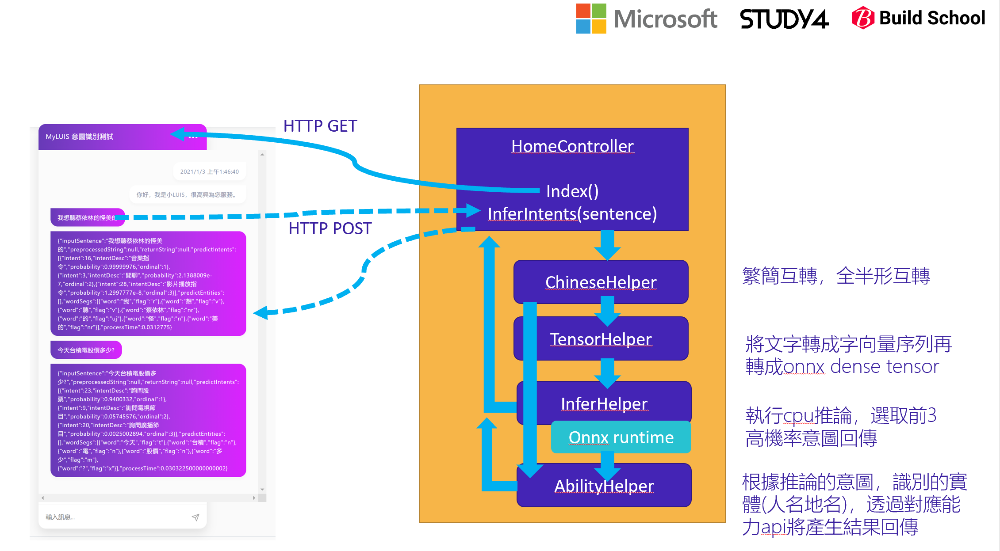
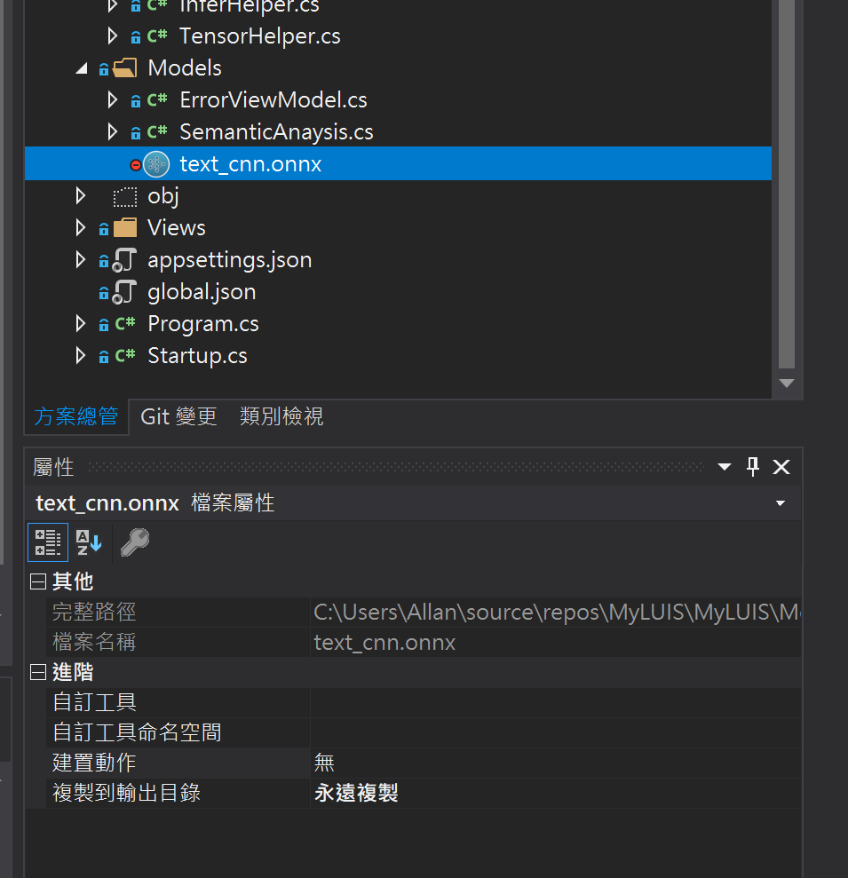
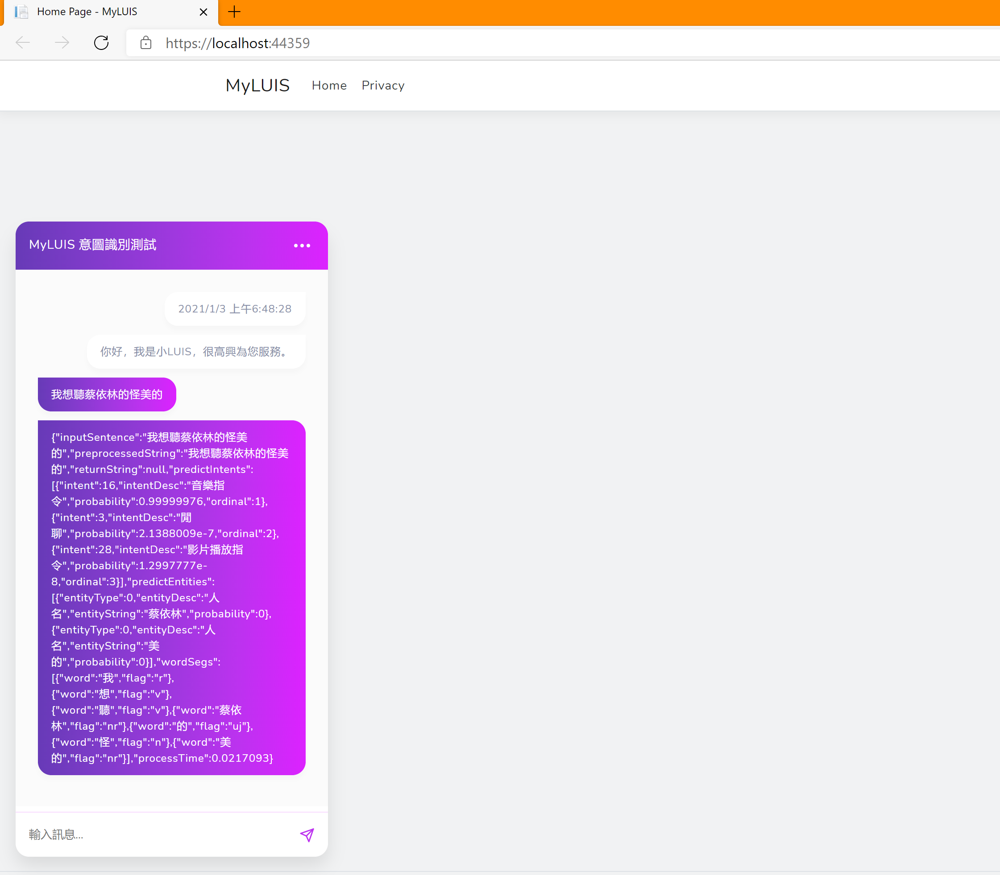

# MyLUIS

這是NET Conf. 中課程【打造自己的繁體中文LUIS服務】的課程實作範例
在這範例中將從建置意圖識別模型出發，將模型轉檔後，透過MVC整合前後端，來實現如同微軟認知服務中LUIS的功能。

## 使用方法
- 意圖識別建模實作請參考「[洞悉你的意圖](https://github.com/AllanYiin/DeepBelief_Course5_Examples/tree/master/epoch802_%E6%B4%9E%E6%82%89%E4%BD%A0%E7%9A%84%E6%84%8F%E5%9C%96)」
- 下載本專案(本專案使用NetCore 3.0.100)
- 復原相關nuget package:
	+ JiebaAspNetCore.Segmenter
    + Microsoft.AspNetCore.Mvc.NewtonsoftJson
    + Microsoft.ML.OnnxRuntime
    + Newtonsoft.Json
    + NumSharp
    + System.Numerics.Tensors
    + TraditionalChineseToSimplifiedConverter
    
- 請先至[這裡](https://1drv.ms/u/s!AsqOV38qroofiZuLXJdFwSXKpaTPBs4?e=cZKvhq)下載相關模型檔案，主要是因為github有單個檔案25MB大小上限。下載後請將「text_cnn.onnx」則複製至專案中的「Models」中，並且將此模型物件的「複製到輸出目錄」的屬性設為「永遠複製」

- 建置後執行偵錯即可測試聊天機器人與語意理解相關功能。

